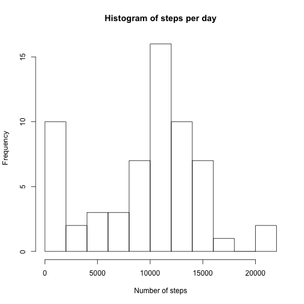
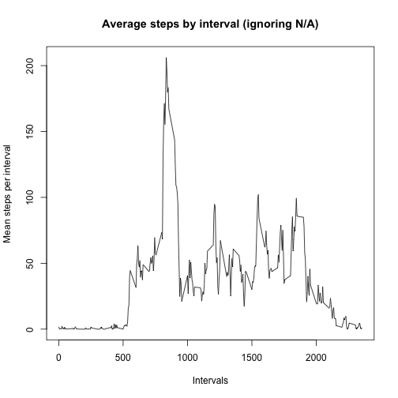
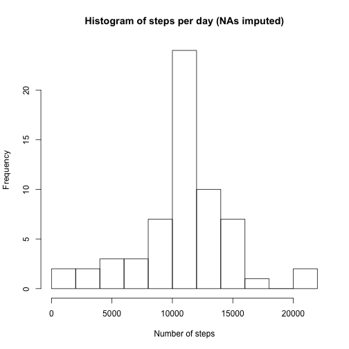
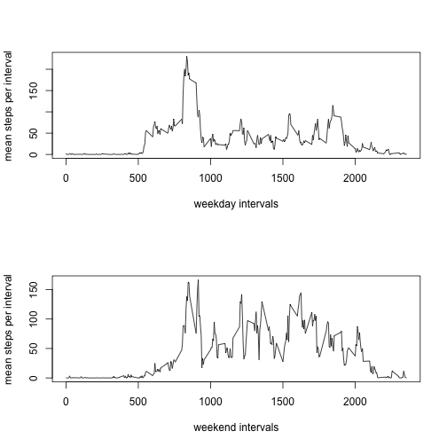

Loading and preprocessing the data.


```r
library(plyr)
unzip("activity.zip")
activity <- read.csv("activity.csv")
```

### 1. What is the mean total number of steps taken each day?

```r
#summarize by day
stepSums <- ddply(activity, .(date), summarize, sum = sum(steps, na.rm = TRUE))
hist(stepSums$sum, breaks = 10, xlab = "Number of steps", main = "Histogram of steps per day")
```

 

```r
stepMean <- mean(stepSums$sum, na.rm = TRUE)
stepMedian <- median(stepSums$sum, na.rm = TRUE)
```

The mean number of steps per day is 9354.2295082.

The median number of steps per day is 10395.

### 2. What is the average daily activity pattern? (ignoring N/A)


```r
# summarize by average steps per interval
intervalSteps <- ddply(activity, .(interval), summarize, average = mean(steps, na.rm = TRUE))
plot(x = intervalSteps$interval, y = intervalSteps$average, type = "l", main = "Average steps by interval (ignoring N/A)", xlab = "Intervals", ylab = "Mean steps per interval")
```

 

```r
# Which interval, on average, has the most steps?
sortInterval <- intervalSteps[order(intervalSteps$average, decreasing = TRUE) , ]
maximum <- sortInterval[1,1]
```

The interval with the most steps on average is 835

### Imputing missing values


```r
missing <- nrow(activity[activity$steps == "NA",])
```

There are 2304 missing values in the data set.


```r
# fill in missing steps using the mean for each interval
        # merge dfs with interval averages 
merged <- merge(activity, intervalSteps, by = "interval")
        #subset NAs, replace with averages
mergedNA <- subset(merged, is.na(merged$steps) == TRUE)
        # replace NAs
mergedNA$steps <- mergedNA$average
        # subset merged data without NAs
merged2 <- merged[is.na(merged$steps) == FALSE,]
        #c ombine remaining dfs for merged3 with NAs replaced by interval means.
merged3 <- rbind(merged2, mergedNA)

intervalSums <- ddply(merged3, .(date), summarize, sum = sum(steps, na.rm = TRUE))

hist(intervalSums$sum, breaks = 10, xlab = "Number of steps", main = "Histogram of steps per day (NAs imputed)")
```

 
Do these values differ from the estimates from the first part of the assignment? What is the impact of imputing missing data on the estimates of the total daily number of steps?

        The effect of imputing missing values is to eliminate the large number of days with zero steps.
        
### Are there differences in activity patterns between weekdays and weekends?
        Our subject appears to still be an early riser, but appears to be more active on weekend afternoons, perhaps not sitting at a desk?
        

```r
# weekdays Transform dates from category to date
merged3$weekday <- weekdays(as.Date(as.character(merged3$date), "%Y-%m-%d"))

# add weekend variable
merged3$weekend <- merged3$weekday == "Saturday" | merged3$weekday == "Sunday"

# create factor variable "type"
merged3$type <- factor(merged3$weekend, levels = c("TRUE", "FALSE"), labels = c("weekend", "weekday"))

# summarize based on type
weekdayIntervals <- ddply(merged3, .(interval, type), summarize, mean = mean(steps))

#subset weekdays and weekends
weekdays <- subset(weekdayIntervals, type == "weekday")
weekends <- subset(weekdayIntervals, type == "weekend")

#plot weekday, weekend interval means
par(mfcol = c(2, 1))
plot(x = weekdays$interval, y = weekdays$mean, type = "l", xlab = "weekday intervals", ylab = "mean steps per interval")
plot(x = weekends$interval, y = weekends$mean, type = "l", xlab = "weekend intervals", ylab = "mean steps per interval")
```

 

